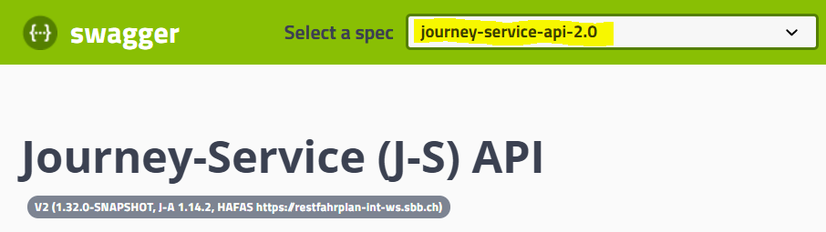

# Journey-Service::B2C Developer Manual
Support: journey-service@sbb.ch

## Abstract
The Journey-Service is a RESTful facade abstracting **public transportation routing and planning** for a set of underlying systems, such as Hafas, HIM, CUS, INFO+, DiDok, FOS, PLABE, OccupancyPrognosis.

The main **use cases** are:
* Finding locations, such as Stations (trains, busses, tramways, ..), Addresses and Points of Interest (POI).
* Finding concrete journeys (Trip's) for a traveling passenger
* Finding concrete Transport-Product journeys
* Providing details about Trainformations, sections, wagons and their occupancy

A set of implemented **Business Rules** (such as delays, platform changes,..) guarantees that consuming channels may display consistent data.

Lots of convenient utilities provide **easy interpretable models**.

Journey-Service logic and backend interfering is heavily based on the (SBB internal) library Journey-Assistant (J-A), therefore J-A documentation or even J-A Javadoc might be helpful as well, if you need to dig in deeper.

If you are new to journey-planning with SBB, the **[OpenJourneyPlanner](https://dms.vdv.de/mitglieder/Seiten/ojp.aspx) Standard** might give you a broader picture, what commonly is understood by this context.

## Technical aspects
### URLs
We currently support 3 Openshift (OTC) environments for testing and operation by by **APIM `Customer information -> Journey-Service`**
 * **TEST** via APIM https://developer-int.sbb.ch/apis/journey-service-test/ (early tests of newest features)
 * **INT** via APIM https://developer-int.sbb.ch/apis/journey-service (solid state, release-candidates)
 * **PROD** via APIM https://developer.sbb.ch/apis/journey-service (production state, well scaled and hopefully stable)

Important:
* All consumers must go through a proper [User-Registration-Process](User-Registration-Process.md) to get granted to APIM.
* **Data per environment is completely detached from other environment**, by means results on DEV, TEST, INT and PROD **may differ (like different routings, stations, translations, accessibility infos, ..) and are therefore -not comparable among 2 environments-**.

### Backward compatibility
We have different concepts to maintain backward compatibility:

#### URL versioning
All `/b2c/v2/*` APIs **without** `INCUBATOR` in their URL may be considered as **stable**. Any breaking changes will be signaled by our Release-Manager (to the e-Mail you registered at APIM registration process)!

Any **APIs with `/b2c/v2/INCUBATOR/*` in their URL are highly @Experimental and might be changed breakingly on a daily basis or might even be deleted without further notice** (if you use it, make sure you keep frequent communication with journey-service@sbb.ch).

#### Deprecated stuff
Any APIs to be removed soon, will have a `@Deprecated` annotation and will be easily visible in the Swagger-UI (check any migration hints given and migrate as soon as possible).

Some **properties in response models might have a "description" like "@Deprecated use ... instead"**. Unfortunately such marks are not optically supported by Swagger and you have to go through each model-property description carefully.

Important:
* The **generated journey-service-client (see below) does not show any `@Deprecated` fields**, therefore you have to check the Swagger Doc carefully for your cases.
* Such deprecated code will be removed in future versions finally

### Testing your APIM access
See [Getting started with APIM](https://confluence.sbb.ch/pages/viewpage.action?spaceKey=AITG&title=Getting+started+with+APIM)

Please check our [Testing hints](Test%20your%20access.pdf)

### journey-service-client (SBB staff only)

Be aware that the J-S::B2C team provides a **generated  response-model and an ApiClient to perform requests** for convenience reasons:
* SBB Bitbucket [journey-service-client](https://code.sbb.ch/projects/KI_FAHRPLAN/repos/journey-service/browse/journey-service-client)
* A [showcase](https://code.sbb.ch/projects/KI_FAHRPLAN/repos/journey-service/browse/journey-service-integration/src/test/java/ch/sbb/ki/journeyservice/showcase/client) demonstrates its usage with minimal developing effort.

SBB Artifactory dependency:

    <dependency>
        <groupId>ch.sbb.ki.journey-service</groupId>
        <artifactId>journey-service-client</artifactId>
        <version>${journey-service.version}</version>
    </dependency>

However, if the provided client does not work for you (for e.g. wrong Spring/SpringFox/Swagger-Annotation versions, ..) you may generate it yourself according to the [json-definitions](https://ki-journey-service.app.idefix.otc.sbb.ch/v2/api-docs?group=journey-service-api-2.0) related to the given contract:
1. Create a [TestCase](https://code.sbb.ch/projects/KI_FAHRPLAN/repos/journey-service/browse/journey-service-boot/src/test/java/ch/sbb/ki/journeyservice/web/SwaggerDefinitionModelGeneratorTest.java) instantiating J-S and download the swagger-json-definition, for e.g. like 
2. Generate client (we use `swagger-codegen-maven-plugin` in [pom.xml](https://code.sbb.ch/projects/KI_FAHRPLAN/repos/journey-service/browse/journey-service-client/pom.xml) for e.g.)
3. Be aware of known bugs we fixed: [OffsetDateTime problem](https://code.sbb.ch/projects/KI_FAHRPLAN/repos/journey-service/commits/312479191d4d500922a533fbdd4e357d7d139e21), [Encoding](https://code.sbb.ch/projects/KI_FAHRPLAN/repos/journey-service/commits/b7934e8c54ef2c83b7a9a8d03d38ff0a78697b4d)

### Good to know
#### Release Notes
See [SBB staff release notes](https://code.sbb.ch/projects/KI_FAHRPLAN/repos/journey-service/browse/ReleaseNotes.md)

#### Model with version suffix
Why do we use some Models with a Version suffix, for e.g. TripV2, StopV2, ..?

Unfortunately our APIM (3Scale) does not support multiple JSON definitions (multi version) though Swagger would support such a concept by grouping.
Therefore we melt classes with the same name by adding different version suffixes per Swagger group and publish them as ONE JSON definition file.

#### OffsetDateTime encoding
See  [Support stricter encoding](https://github.com/spring-projects/spring-framework/issues/21577)
400: ..?dateTime=2019-04-23T14:56:14+00:00
OK: /b2c/v2/departures?originUIC=8503000&dateTime=2019-04-27T14%3A50%3A37.375%2B02%3A00

## API in detail
All Services (short abstract, request-parameters, response-models) are documented directly by swagger-annotations, therefore the documentation below is reduced to the max and is hopefully not really necessary for v2 API understanding in most cases.

### Choosing the right service definition
Select the version of J-S REST-API: currently **v2**

Remark:
* If accessing by APIM, some APIs may not be visible (compared to SBB internal access) or accessable (based on your "plan per API").
* v1 is deprecated and for reserved SBB internal usage

| Aspect | /v2 (current version) |
|--------|-----------------------|
|API-Path|/b2c/v2/*              |
|Request-Header	|like "Accept-Language" is used for standard or meta aspects (which are not in)|
|Request-Params|GET ?param1=..&param2=..
|Response-Header|like "Content-Language" (relates to "Accept-Language" or fallback-language by J-S)
|Response-Body|returns HttpStatus and declared model|
|arg defaulting|better defaulting (for minimal performance)|
|Realtime handling|less but well calculated attributes → consumer needs to analyze much less or nothing at all|

### End-user consistency
According to **SBB KI strategy (de:Kundeninformation)** it is a **declared goal to communicate consistent public transport information**! 
**J-S plays an important role** to provide such consistency **to any passengers on any end-user API resp. UI-channel**.

**J-S consumers must be aware that they might violate these SBB business rules by ignoring, manipulating or redefining given values and may impact unwanted end-user or public media critics**.

Some expressions are even related to **conventions by [BAV](https://www.bav.admin.ch/bav/de/home/verkehrsmittel/eisenbahn.html), SBB Infrastructure, SBB Personenverkehr or public transport Switzerland** in general.

### Request
For each Request to J-S set the mandatory header-fields and body fields.

### Response
#### Error-handling
See Swagger API doc concerning known or expectable HttpStatus (for e.g. 400 BAD_REQUEST)

In most cases the body will contain a detailed error, according to [RFC-7807](https://tools.ietf.org/html/rfc7807):
* Header: HttpStatus resp. high-level error class
* Body: finer-grained details of the problem (machine-readable format, the client can treat it appropriately) ** section 3.1 declares members of a Problem Details (problem+json) Object: status, type, title, detail, instance
Error texts in "title" or "detail" will be given according to "CONTENT-LANGUAGE" (though mostly in english) and:
* are not meant to display to end-users 1:1, proper error handling and displaying is the responsibility of the UI developer
* can be used for consumer logging and might be helpful in postponed analysis tasks
* the contents of such errors relate to underlying system and what J-S thinks is appropriate from the viewpoint of its layer

For example, an HTTP response carrying JSON problem details:
    HTTP/1.1 204 Not Found
    Content-Type: application/problem+json
    Content-Language: en
    Log-Context: <your value replied>
    {
      "type": "https://ki-journey-service.app.ose.sbb-cloud.net/sbb/v2/trips",
      "title": "No hits",
      "detail": "There were no trips found for your query arguments.",
      "instance": "/v2/trips"
    }

SBB staff: see also [error-handling](https://code.sbb.ch/projects/KI_FAHRPLAN/repos/journey-service/browse/journey-service-b2c/V2_Error-Handling.md)

##### 200 for emptyList, 404 for not found Object?
v2 is based mostly on HTTP GET (idempotent), therefore various variants are technically possible to signal "No hits found"!

The J-S team thinks it is best to return:
* 200 with an emptyList body "{}" for API's returning List<T> where no hits were found
* 404 with an optional Error body as described above if an expected object cannot be found, for e.g. /v2/trips/{reconstructionContext} which may not resolve

##### 400
Swagger annotations are heavily used to validate the API. In such cases no error-body is returned sometimes. Please check the Swagger-UI carefully.

#### Business data aspects
Some properties resp. their value-expressions might be **translated according to requested "Accept-language" to german (de), french (fr), italian (it) and english (en)** for e.g.:
* Station-Names in request accept all 4 languages usually, though the reply (StopV2::name) contains only the local Switzerland translation as a special case (Geneva → Genève)
* Note::value is sometimes translated by SBB P Data-Mgmt
* Translations with a standard (TransportProductV2::trackTranslation) and short-translation (TransportProductV2::trackTranslationShort):
* other texts are translated by SBB Business Rules, like StopV2::*DelayText

J-S uses some Enum's which relate typically to business defined values, for e.g.:
* TransportProductV2::category
* VehicleType
* LegType
* ...

There are also specific extensions for developer convenience, such as:
* TransportProductV2::vehicleIconName showing the appropriate name in **SBB Corporate-Identity resources** (though the resource itself must be allocated by the consumer)
* the developer is still free whether he prefers its own mapping from TransportProductV2::vehicleType or uses the J-A given short cut to ::vehicleIconName

#### Business logic aspects
##### Formatted fields
J-S sometimes provides fields with a "*Formatted" suffix which contain values, that must be showed to public end-users instead of alternatively declared field without the suffix for SBB internal usage only, for e.g.
* TransportProductV2::number → B2E only: meant for SBB internal services or employees (for e.g. to display in SBB Casa to be seen by SBB employees only)
* TransportProductV2::numberFormatted → B2C or B2P: Business Rule impacted value for end-users (for e.g. to display in SBB Webshop, SBB Mobile, ..)

##### Realtime analysis
Getting the right realtime conclusions can be tricky, therefore J-S provides convenience data whenever possible.

StopV2 for e.g. contains pre-calculated fields to inform about relevant realtime status of a TransportProductV2 at a specific StopV2:
* ::boardingAlightingStatus
* ::stopStatus

About any *Rt properties:
* Ideally these fields are always null, means transport organisations are operating as planned
* If any vehicle (TransportProductV2) is not operating according to its scheduled plan, *Rt fields may contain correcting values here and there (availability usually max 2h in the future and may disappear quickly in the past, because irrelevant for the current instant in time)
* *Rt fields may update their values for the same trip or journey if repeatedly requested, since they express “real-time” behaviour. (However do update your query as less as possible, for performance reasons.)
* If the *Rt fields are empty, just use the corresponding (same name) fields without “Rt” suffix for properly planned values

Journey-Service does not know the exact position of a vehicle yet and does not even guarantee that a vehicle has passed a station in reality. (However we have stories to transmit such additional info in the near future.)

Remark:
* SBB staff see [STATION state]( based on /display/FAHRPLAN/Haltestellen-Status)

### Most typical use cases
Most consumers will probably be interested in a simple train-connection from A to B. This scenario is supported in 2 steps usually:

1. use /b2c/v2/locations to find A=origin (start) and B=destination (end) Location's → any Location hit with type=STATION will have a concrete UIC standardized ID as given in the "uicOrId" field (for e.g. 8507000 for "Bern").
2. use /b2c/v2/trips to find a set of trips (usually between 4..7 hits) and interprete the best case in your case. The reponse TripV2 object will contain Leg's (segments operated by a specific transport-company (for e.g. "SBB") and a list of Stop's where A=stops[0] and B=stops[last], each Stop has various data such as departureDateTime, stopStatus, ...

### Info API
Concepts:
* The **timetables for all public transportation products are renewed on a yearly base** (de: Fahrplanwechsel). There is typically a change about 1st decade of December.

Remark:
* For most users this service will not be relevant. J-S will navigate in the current pool automatically or throw errors if your queries do not match the current period.

#### /v2/info
Returns "PoolInfo":
* declaring the current service-days period (usually current year between first decade of december)
* STATION data-pools (validity periods of operation)

#### /v2/traffic
Allows search for active HIM-Messages about disruptions, construction sites, events,..

Be aware:
* HimMessageV2 objects related to concrete journeys are returned by /v2/trips in LegV2::messages or JourneyDetail::himMessages directly

### Location API
Useful to query for locations (stations, addresses, POIs).

Concepts:
* Switzerland uses UIC codes for station IDs, DiDok maps other countries to UIC as well and therefore troughout J-S such values like 8507000 for "Bern" are consistent.
* Addresses are postal addresses imported from Swiss POST in regular phases.
* Points of Interest (POI) are licenced data such as Museums, Shopping mall etc.

#### /v2/locations
Returns a generic structure of a Location. Discriminator Location::type specifies a Locationas:
* **STATION** (known Stop, routed by Hafas)
* **ADDRESS** (postal addresses)
* **POI** (points of interest, like Museum, ..)

### Journey-Planning services
There are various ways to query for vehicle (transport-product) routes or tailored passenger trips from A to B.

Concepts:
* All journeys rely on a yearly plan (de:Soll-Fahrplan).
* However in reality not all transport-products may be operated in time, therefore realtime changes happen to the plan, see [J-A: Trip-Analyse](https://confluence-ext.sbb.ch/display/JAD/J-A%3A+Trip-Analyse)
* Trip's are tailored traveling routes for a specific passenger. They do not have a unique ID, rather a reconstruction- or Trip-Context. Each Leg means a separate transport-product (by means passengers need to change at the ending Stop of a Leg). The underlying system provides a default change time when passengers need to switch transport-products. However these values may be customized as well.
* JourneyDetails cover the whole scope of a single transport-product from the very start to the very end. They might be identified by a unique JourneyReference (which is not a physical vehicle-ID).
* Time aspects: For Switzerland most date/time data is given in Swiss timezone "Europe/Zurich" (however check OffsetDateTime UTC values for foreign Locations).

#### Stationboard API
##### /v2/departures
Departureboard (de:Abfahrtstabelle) at STATION showing departures leaving from there with optional directions.

##### /v2/arrivals
Arrivalboard (de:Ankunftstabelle) at STATION showing arrivals.

#### Trips API
Complex Journey-Planning (connections or de:Verbindungen) for travelling passengers.

#### /v2/trips
 
Accessibility is supported on some transport-products (depends on given operator-data). The following Enum's have a Business Rule related hierarchy which is handled by response:
* "BOARDING_ALIGHTING_SELF"
* "BOARDING_ALIGHTING_BY_CREW"
* "BOARDING_ALIGHTING_BY_NOTIFICATION"
 
Scrolling: any /trips request returns a set of TripV2 within 0..7 hits. To get previous or next hits use the Header field "SCROLL-CONTEXT":
1. /trips inital search -> Response with "scroll*" Header-fields
2. execute very same Request (identical parameters) and set Header scrollContext= with SCROLL-FORWARD or -BACKWARD value
 
Eco calculation comparing public transportation vs private car or airplane:
* set request param "calculateEco":"true" -> check response for EcoBalance

Vias are optional routing points to be included or avoided for trips.

&trainFormationType= for performance reasons keep the default, if you are not interested in Train-Formations!
By default no Train-Formation hints are given. You may then call /v2/trainFormation anyway, but to get an early hint specify HINT_ORIGIN_DESTINATION to get such an info on each TripV2::LegV2::formationHint

&createSummary= will add a "TripV2::summary" as an overview with realtime and him-messages about the trip. Further on, in StopV2::stopStatus according to SBB Business Rule a state will be calculated
/v2/trips/{reconstructionContext} (GET)
Parameter "reconstructionContext" is given in any previous TripV2::reconstructionContext response by /v2/trips request.

Be aware:
* The goal is to recreate the origin TripV2 where the reconstructionContext is taken from
if your interested in accessibility (de:Barriere frei) data, make sure the previous /v2/trips request called for &accessibility=
however reconstruction is not guranteed for various reasons (realtime changes, ..) -> catch 404 therefore

##### /v2/trainFormation/{reconstructionContext}
TrainFormation (de:Zugformation) may be requested for Legs with LegType.PUBLIC_JOURNEY by this API.

Returns details about train-compositions their wagons, sections and Occupancy at origin and destination of a Leg.

See [J-A: Zug-Formationen](https://confluence-ext.sbb.ch/display/JAD/J-A%3A+Zug-Formationen)

Be aware:
* Train-Formations are considered realtime data, therefore they are only available today! Do not request in the past or in the future, those will be lost requests.

Request a desired trip by /v2/trips, if you are interested in formations consider setting &trainFormationType=HINT_ORIGIN_DESTINATION
will give you a TripV2::legs → LegV2::formationHint whether it is worth to request for TrainFormation's at all by this service
Call this API if FormationHint is given (or just by chance if you like)
404 is returned if the reconstructionContext cannot be resolved by Hafas
FUTURE USE:

&trainFormationType=ORIGIN_DESTINATION → will return TrainFormation directly at first call

#### Routes API
About JourneyDetail (de:Zuglauf).

##### /v2/routes/{journeyReference}
Such JourneyReference values may be obtained by Trip::Leg::journeyReference oder Departure/Arrival::journeyReference

#### Reports API
SBB dedicated usage for FZF (Fahrplan-Zusatz-Funktionen)
