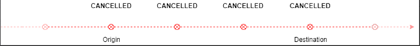

# Routing Basics
## Public transportation routing

### Capabilities of J-S

* Provide a yearly managed **service-calendar** (typically from 1st decade of December) and enrich by current realtime-data by relevant underlying timetable source in Switzerland and Europe. (Typically there are major routing data changes/optimizations per timetable period in Switzerland).
* Providing consistent and convenient **trips** (aka itinerary, passenger journey) like travelling from A -> B -> C based on complex and efficient routing algorithms and weighting parameters, considering various origin (above “A”)/destination (above “C”) **points** connected by **legs** operated by **vehicles** (aka service-products, transport-products) within a given time-frame.
* Passing vias (for e.g. “B” above) may impact a vehicle change for passengers, therefore **transfer** hints are provided (for e.g. duration, quay (aka platform), involved footpath,..).
* If your planned trip "goes wrong", realtime aspects (like delays, broken vehicles, place changes, ..) hints will be given as adjustment or propoposal about your options.

### Routing API
J-S may be distinguished into the following aspects, where routing is related to point-to-point connections.

#### Places
* **Place** (mainly StopPlace): Points to navigate, like geographical locations on a map.
* **Address** is a postal address for footpath navigation
* **PointOfInterest** is "categorized" place, like a Museum or Parking.

#### Vehicle-Journeys
* **DatedVehicleJourney** showing planned routes by a specific vehicle resp. service-product (for e.g. may operate daily on line like an "IC 1 <number>"). The service-product involves a physical vehicle (for e.g. TRAIN, BUS, ..) operates in a given time-frame. It consists of a ordered by passing-point list of stop-points (increasing routeIndex per Stop).
    * Sub-types may be distinguised like a view, for e.g. by arrival- or by departure-boards.
    * Or become a public-transportation leg (like **PTRideLeg**)
* **Leg**: 1..* (partial) DatedVehicleJourney's making up a Trip.

##### Stop-points
* **ScheduledStopPoint** is related to a Place (typically StopPlace in public transportation) but is only given on vehicle-journeys.
* contains departure-/arrival-times, quays, ..

###### Boarding/Alighting
Each ScheduledStopPoint contains passenger information, whether it is:
* ::forBoardingboard
* ::forAlighting

###### StopStatus
Each stop-point has a proper **StopStatus**, which is impacted by the current realtime-situation and might be visualized on a DatedVehicleJourney:
**PLANNED**
Stop was planned according to plan-data and behaves as planned yet to the current realtime situation.

**(Partially) CANCELLED** (de:Ausfall)
A PLANNED stop has a drastic change by realtime, the vehicle might not be able to be boarded or alighted!

Stop was planned in plan data but it is part of cancelled Journey in realtime data:

On a Leg boarding at origin or alighting at destination will not be possible (relates to Trip::status::valid=false):

* BEGIN_PARTIAL_CANCELLATION: Alighting might still be possible, but boarding is not possible.
* END_PARTIAL_CANCELLATION: Alighting not possible, but boarding might still be possible,

NOT_SERVICED (de:ausserordentliche Durchfahrt)
A station which was planned in plan data but for some reason the service-product does not halt any more.
Condition ::isRedirected == true  

UNPLANNED (de:ausserordentlicher Halt)
A station which was not planned in plan data bus is an additional stop in realtime data.

#### Trips
A **Trip** represents a complete ride a passenger requested (for e.g. by SBB Mobile by from/to search criterias) of a traveler/passenger, therefore in the example above it consists of 2 Legs (A->B and B->C) and various other data.

Trip::legs: 
* Each PTRideLeg is assigned to a physical service-product (vehicle), by means passengers may board at origin-point and alight on destination-point. 
* A transfer from leg to leg happens, if an arrival via-point is reached and passenger may transfer to next Leg. Reachable indicates if next service-product will be boardable or must be skipped because of the current realtim situation.

##### Trip::status
**::isValid**
Basically this is a complex value depending on when you update your trip-Request!
1.	Initially you get a specific Trip by calling v3/trips
      a.	isValid=true (otherwise the trip won’t probably make it into the response at all)
2.	Anytime later you request an update (aka refresh) for that specific Trip by v3/trips/{Trip::id}
      a.	isValid=true remains most often case, by means totally rideable (even if some realtime fields are set)
      b.	isValid=false toggled from previous true to false, by means there is any sudden realtime aspect that makes the **whole Trip impossible at the time of this initial request** (for e.g. the connecting train at a via is not reachable any more)
      i.	analyse this case very carefully! Passengers will probably not reach the destination as planned (separate alternatives must be searched explicitely!)
      ii.	as soon as flag toggles to false, any fields might fall back to planned data only (because realtime updates might be irrelevant by now)
      iii.	for SBB Mobile users there is a push-mechanism which might trigger observed trip-updates directly into the App
      
::isCancelled (de: Ausfall), sometimes there is an ::isAlternative service-product

A TripSummary might be created by J-S for a Trip containing most relevant informaitons like an overview.
