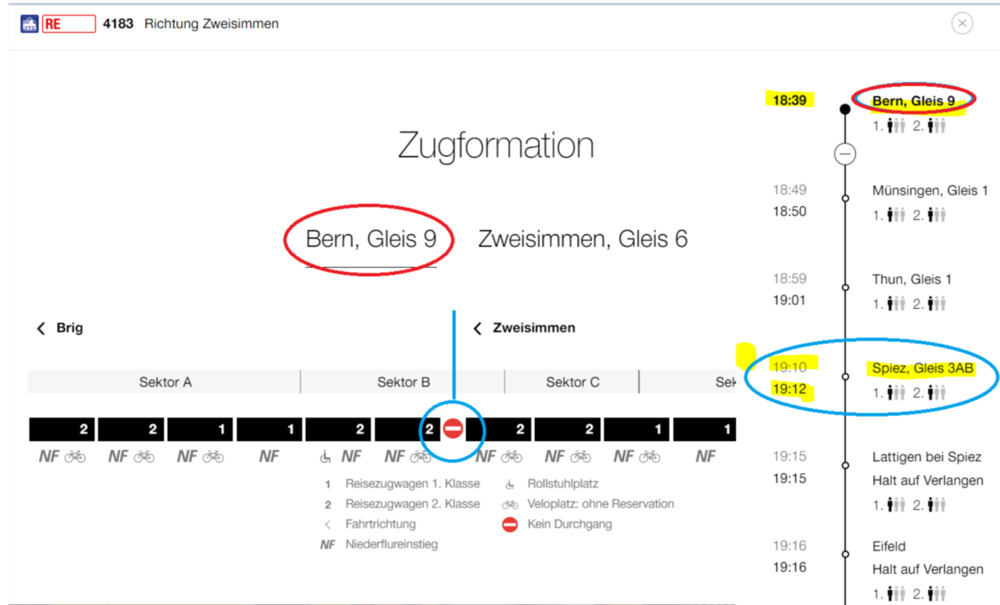
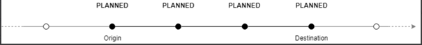
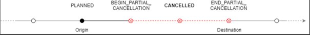

# Routing Basics

## Capabilities of J-S

* Provide a yearly managed **service-calendar** (typically from 1st decade of December) by relevant underlying timetable source in Switzerland and Europe.
    * The `ServiceCalendar` schedules `DatedVehicleJourney's` (see below),
    * (Typically there are major routing data changes/optimizations per timetable period in Switzerland).
* Providing consistent and convenient **trips** (aka itinerary, passenger journey) like travelling from A -> B -> C based on complex and efficient routing algorithms and weighting parameters, considering various origin (above “A”)/destination (above “C”) **points** connected by **legs** operated by **vehicles** (aka service-products, transport-products) within a given time-frame.
    * A `Trip` consists of 1..* `Leg's` (`PTRideLeg` for public transportation, `AccessLeg` for footpath or `PTConnectionLeg` which is a kind of unknown path between 2 `StopPlace's`) 
    * Passing vias (for e.g. “B” above) may impact a vehicle change for passengers, therefore **transfer** hints are provided (for e.g. duration, quay (aka platform), involved footpath,..).
* If your planned journey (aka itinerary) "goes wrong", **realtime aspects** (like delays, broken vehicles, place changes, etc) hints will be given as adjustment or propoposal about your options.

## Public transportation routing
J-S may be distinguished into the following aspects, where routing is related to point-to-point connections.

### Places
* **`Place`** abstract specialisation
* **`StopPlace`**: Points to navigate, like geographical locations on a map.
* **`Address`** is a postal address for footpath navigation
* **`PointOfInterest`** is "categorized" place, like a Museum or Parking.

### ServiceJourney
According to Transmodel a "**VehicleJourney is a planned movement of a _public transport Vehicle_ (for e.g. a TRAIN or a BUS) on a specific operation-day from the (very) start point to the (very) end point** (of a JourneyPattern on a specific route)".

J-S implements a reusable structure `ServiceJourney` which contains all public transportation properties, such as a list of `ScheduledStopPoint's` on such a VehicleJourney in its context:
* **`DatedVehicleJourney`** representing the complete VehicleJourney by a concrete `ServiceProduct` ("IC 1 <number>" an specific operating day). A physical vehicle (for e.g. TRAIN, BUS, ..) is therefore involved and passengers may board/alight it. 
* **`Arrival`** is a (partial) `DatedVehicleJourney` but with focus on arrival at a specific `StopPlace`.
* **`Departure`** is a (partial) `DatedVehicleJourney` but with focus on departure at a specific `StopPlace`.
* **`PTRideLeg`**: (partial) `DatedVehicleJourney` as part of a `Trip`.

#### Stop-points
* **`ScheduledStopPoint`** is related to a `StopPlace` (like "Bern") and dependending on the context in the `ServiceJourney` consists of two important `StopCall's`:
    * `::arrival` aspects (like planned time or reatime impacts). Usually alighting is possible.
    * `::departure` aspects (dito). Usually boarding is possible.
    * Be aware, there may be any coupling or decoupling of `Train's` for e.g. in case of wingtrains as illustrated below:
        * The `CompoundTrain` (aka formation, composition) at "Bern" is shown in its departure snapshot
        * The "one-way" symbol shows that passengers may not walk from car to car (`TrainElement`) and in this case some decoupling will happen between the arrival and departure `StopCall` at `StopPlace` "Spiez", which might be guessed by different _direction's_ (namely "Zweisimmen" and "Brig"). However, it is important for the passenger to board the appropriate cars at "Bern" (or before the decoupling stop-point) to not end-up at the wrong destination.

###### Boarding/Alighting
Each `ScheduledStopPoint` contains passenger information, whether it is:
* `::forBoarding`
* `::forAlighting`

###### StopStatus
Each stop-point has a proper **`StopStatus`**, which is impacted by the current realtime-situation and might be visualized on a `DatedVehicleJourney`:
**PLANNED**
Stop was planned according to plan-data and behaves as planned yet to the current realtime situation.  

**(Partially) CANCELLED** (de:Ausfall)
A PLANNED stop has a drastic change by realtime, the vehicle might not be able to be boarded or alighted!

Stop was planned in plan data but it is part of cancelled Journey in realtime data:  

On a Leg boarding at origin or alighting at destination will not be possible (relates to Trip::status::valid=false):  

* BEGIN_PARTIAL_CANCELLATION: Alighting might still be possible, but boarding is not possible.
* END_PARTIAL_CANCELLATION: Alighting not possible, but boarding might still be possible,

NOT_SERVICED (de:ausserordentliche Durchfahrt)
A station which was planned in plan data but for some reason the service-product does not halt any more.
Condition ::isRedirected == true  

UNPLANNED (de:ausserordentlicher Halt)
A station which was not planned in plan data bus is an additional stop in realtime data.  

### Trips
A **`Trip`** represents a complete ride a passenger requested (for e.g. by [sbb.ch](https://www.sbb.ch/en/buying/pages/fahrplan/fahrplan.xhtml) or _SBB Mobile_ by from/to search criterias) of a traveler/passenger, therefore in the example above it consists of 2 Legs (A->B and B->C) and various other data.

Trip::legs: 
* Each `PTRideLeg` is assigned to a physical `ServiceProduct` (operated vehicle by a transport-company), by means passengers may board at origin-point and alight on destination-point. 
* A transfer from leg to leg happens, if an arrival via-point is reached and passenger may transfer to next `Leg`. Reachable indicates if next service-product will be boardable or must be skipped because of the current realtime situation.

#### Trip::status
**`::isValid`**
Basically this is a complex value depending on when you update your trip-Request!
1.	Initially you get a specific Trip by calling v3/trips
      a.	isValid=true (otherwise the trip won’t probably make it into the response at all)
2.	Anytime later you request an update (aka refresh) for that specific Trip by v3/trips/{Trip::id}
      a.	isValid=true remains most often case, by means totally rideable (even if some realtime fields are set)
      b.	isValid=false toggled from previous true to false, by means there is any sudden realtime aspect that makes the **whole Trip impossible at the time of this initial request** (for e.g. the connecting train at a via is not reachable any more)
      i.	analyse this case very carefully! Passengers will probably not reach the destination as planned (separate alternatives must be searched explicitely!)
      ii.	as soon as flag toggles to false, any fields might fall back to planned data only (because realtime updates might be irrelevant by now)
      iii.	for SBB Mobile users there is a push-mechanism which might trigger observed trip-updates directly into the App

`::isCancelled` (de: Ausfall), sometimes there is an `::isAlternative` service-product

A `TripSummary` might be created by J-S for a Trip containing most relevant informaitons like a rough overview.