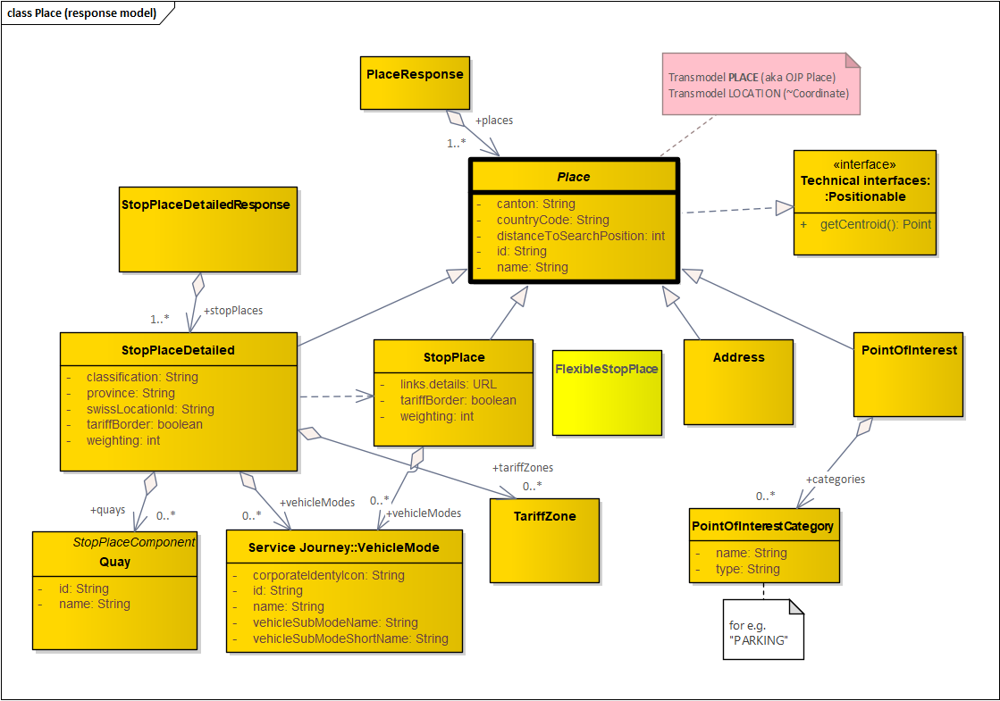

# Journey-Service (J-S) MODEL v3

## The J-S v3 Data-Model

This is about the **implemented routing exchange model** provided by **J-S v3**.

The main reference is **Transmodel [TRM6-v56 (downloads and tutorials)](https://www.transmodel-cen.eu/downloads/)**, though Transmodel is rather a _conceptual specification_ and the J-S devOps Team did not find a satisfying reference-implementation yet. 

However our team is convinced to take TRM as the main guideline for J-S v3, even with the risk, that we might have added some simplifications or our own flavor (based on Journey-Planner experience within SBB P division in the last 5 years with plenty of strategic consumers).

### REST-API (technical context)
J-S v3 comes as a RESTful implementation according to:
 * [Zalando RESTful API Guidelines](https://opensource.zalando.com/restful-api-guidelines/)
 * [OpenApi 3 specification](https://swagger.io/specification/)
     
### Journey-Planner context
API model see [J-S Model classes](https://developer.sbb.ch/apis/journey-service/documentation)
* check for v3/* API classes (ignore deprecated v1 and v2 classes there)

Legend:

#### Place MODEL
Developer simplified view:

Transmodel realization view:

#### ServiceJourney MODEL

Developer simplified view:

Transmodel realization view:

#### Schedule MODEL

## Routing Standards in "Public Transport"

### Transmodel

**Standards** considered:
* **CEN EUROPEAN REFERENCE DATA MODEL FOR PUBLIC TRANSPORT INFORMATION [EN 12896](https://en.wikipedia.org/wiki/Transmodel)**
* J-S v3 is heavily based on the **conceptual [Transmodel](https://www.transmodel-cen.eu/) TRM6-v56**. See [Model download, Glossary, Tutorials](https://www.transmodel-cen.eu/downloads/), mainly on the following parts:
    * Part 1: Commons Concepts
    * Part 2: Public Transport Network
    * Part 3: Timing Information and Vehicle Scheduling
    * Part 4: Operations and Monitoring Control
    * (Part 5: Fare Management)
    * Part 6: Passenger Information
    * (Part 7: Driver Management)
    * (Part 8: Management Information & Statistics)

Beyond Transmodel Standard yet:
* See [Tutorial Part 8, chapter 6](https://www.transmodel-cen.eu/wp-content/uploads/2015/01/TUTORIAL_Part8_v2.1-1.pdf)
    * Service safety: this function considers all the information to evaluate the safety of the PT service in terms of accidents occurred, etc;
    * Service pollution emissions: this function considers all the information to evaluate environment impacts due to the emission of pollutants;

#### OJP
J-S v3 is not an OJP implementation, however OJP is also covered by Transmodel, see [OpenJourneyPlaner (OJP)](https://www.transmodel-cen.eu/ojp-standard/ojp/) _CEN certificated_ and J-S tries to reuse some of it:
* J-S v3 provides similar APIs as OJP (places, trips, ..), but J-S v3 uses the newer terminology and model in TRM6-v56 and is simplified according to SBB Personenverkehr experience
* J-S is rather SBB private, but Swiss SKI OJP is for public use, see [OJP Switzerland](https://opentransportdata.swiss/de/cookbook/open-journey-planner-ojp/).
* Classic Standards in J-S are more abstracted, where the following are more obvious for e.g. by OJP schema references or namespaces:
    * [NeTex](https://www.transmodel-cen.eu/netex-standard/): Network Timetable Exchange (Fare Management & Passenger Information)
    * [Siri](https://www.transmodel-cen.eu/siri-standard/): Realtime Information
    * [IFOPT](https://www.transmodel-cen.eu/ifopt-standard/): Identification of fixes Objects in Public Transport
* [OpenJourneyPlanner VDV](https://dms.vdv.de/mitglieder/Seiten/ojp.aspx)

### ODSM
J-S v3 is not an ODSM [ODSM](https://app.swaggerhub.com/apis-docs/schlpbch/uic-90918_10_osdm/1.4.0) implementation, but may serve as an underlying routing facade for places and trips.
* ODSM is an OJP orientied Ticketing specification among european members and UIC.
* ODSM also has Journey-Planner API's with to focus to distribute international tickets (for e.g. among brokers). See chapter OJP related to J-S v3.
* ODSM is a planned facade in front of NOVA (Switzerland).

## Mapping between Journey-Planner implementations
Bridging/adapting between J-S v3 and
* **[OJP Switzerland](https://opentransportdata.swiss/de/cookbook/open-journey-planner-ojp/)**: J-S is developing an experimental OJP-Adapter to call SKI OJP's XML implementation
* **[ODSM](https://github.com/UnionInternationalCheminsdeFer/OSDM/wiki)**: is a newer specification based on OJP 1.0 extendind ticketing based on Journey-Planner systems, such as J-S v3 or OJP
